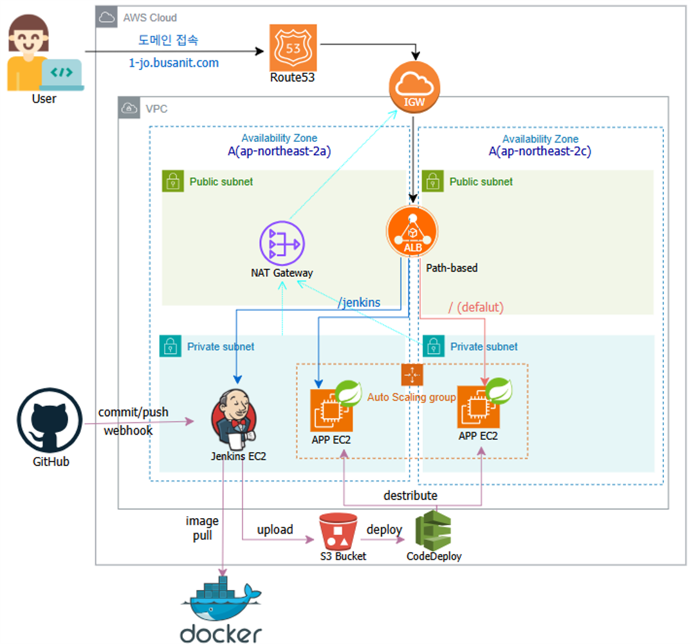
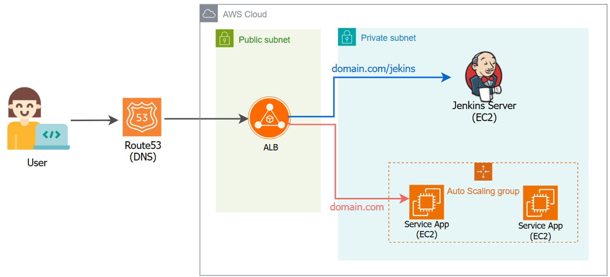

# 🛠 Ansible Server: AWS Infrastructure as Code (IaC)

이 저장소는 AWS VPC부터 Jenkins 서버, 로드밸런서, Auto Scaling 환경까지 **전체 프로젝트 인프라를 Ansible로 코드화하여 자동 구축·관리**하는 Infrastructure as Code(IaC) 프로젝트입니다.  
수동 콘솔 작업 없이 동일한 인프라 환경을 언제든 재현 가능하도록 설계했습니다.

---

## 🏗 Infrastructure Components
- **Network:** VPC, Public/Private Subnets, Internet Gateway, NAT Gateway
- **Compute:** EC2 (Jenkins Server, WAS Instances)
- **Traffic:** Application Load Balancer (ALB), Target Groups
- **Automation:** Ansible Playbooks & Roles (network, iam, security, jenkins, loadbalance, asg, dns)

---

## 🌟 Key Features
- **Idempotency (멱등성)**  
  동일 플레이북을 여러 번 실행해도 항상 동일한 인프라 상태 유지

- **Full Lifecycle Management**  
  자원 생성뿐 아니라 `cleanup.yml`을 통한 안전한 전체 인프라 회수 자동화

- **Security by Design**  
  최소 권한 원칙 기반 IAM Role 설계 및 보안그룹 간 참조 구조 적용

- **Modular Role Architecture**  
  네트워크, 보안, 컴퓨트, 트래픽 계층을 역할 단위로 분리하여 유지보수성과 확장성 확보

---

## 📝 Troubleshooting Case Study

### NAT Gateway 의존성 및 자원 회수 루프 문제 해결

- **문제**  
  인프라 삭제 시 NAT Gateway가 정상적으로 제거되지 않아 VPC 삭제가 반복 실패하거나, 일부 리소스가 재생성되는 현상 발생

- **원인**  
  - 기존 NAT Gateway 존재 여부를 확인하지 않고 생성 로직이 실행됨  
  - 삭제 시 비동기 리소스(ENI) 회수 완료 전에 다음 단계가 진행됨

- **해결**  
  - `ec2_vpc_nat_gateway_info` 모듈로 기존 자원 존재 여부 사전 확인  
  - 삭제 태스크에 `wait: yes` 옵션을 추가하여 의존성 자원 완전 제거 보장  
  → 완전한 무잔존(Zero Residual) 인프라 클린업 구현

---

## 🚀 How to Use
1. AWS CLI 및 Ansible 설치
2. `group_vars/all.yml`에 프로젝트 변수 설정
3. 인프라 구축: `ansible-playbook deploy.yml`
4. 인프라 파기: `ansible-playbook cleanup.yml`

---

## 🎯 Project Goals
  - AWS 인프라 구성 요소를 코드 기반으로 표준화 및 재현 가능하게 관리
  - 멱등성과 안전한 리소스 삭제까지 포함한 실무형 IaC 운영 경험 확보
  - CI/CD 파이프라인 기반 자동 배포 환경을 위한 인프라 토대 구축

## 📌 Architecture

